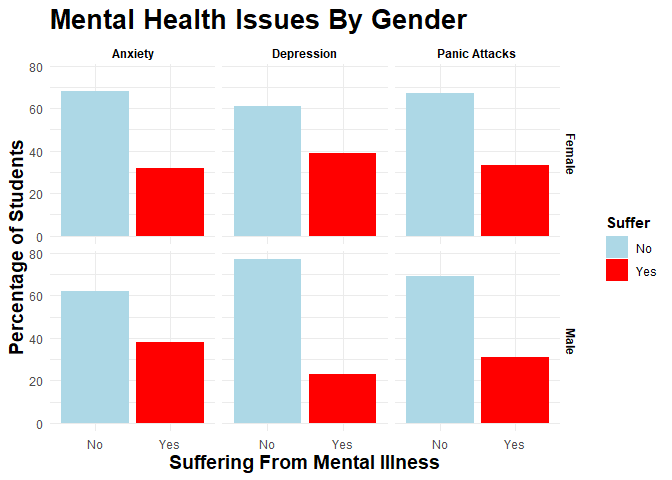
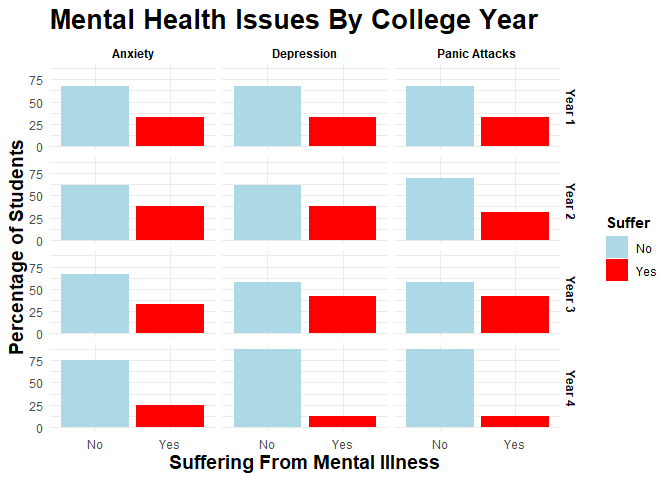
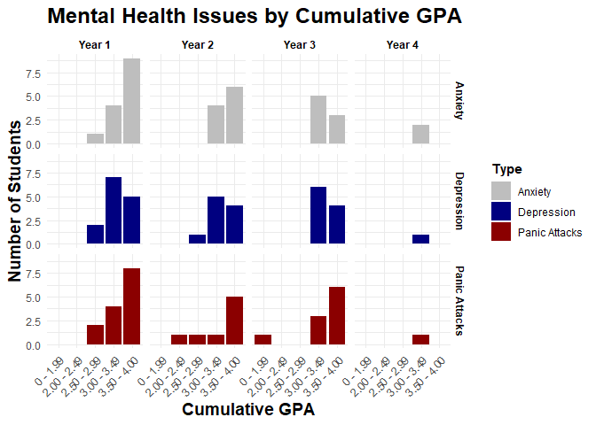
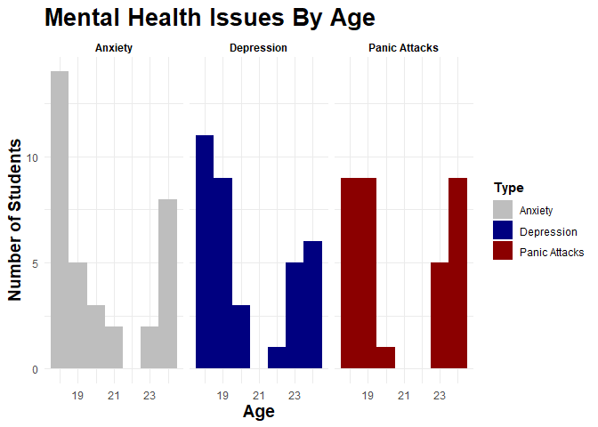
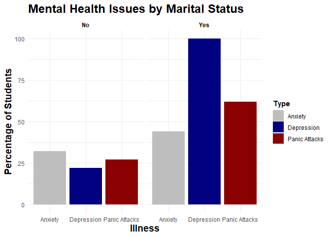
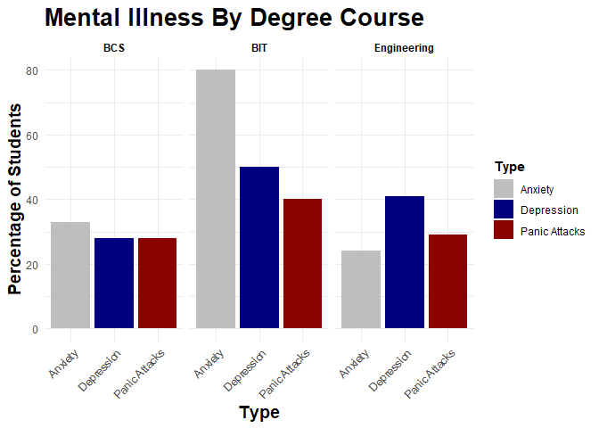
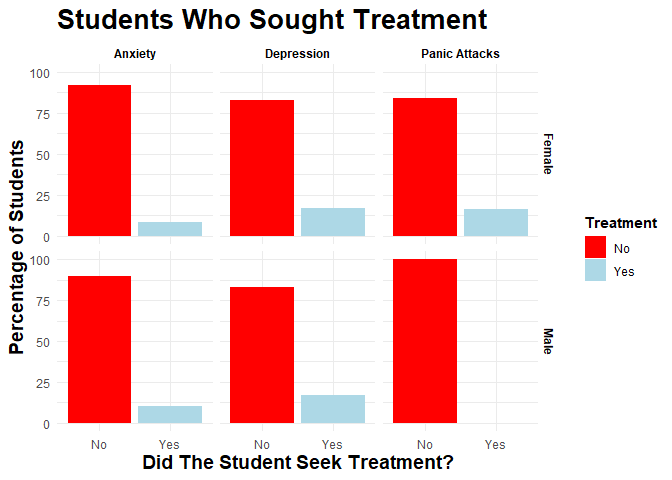

# Investigation Into Mental Health issues In Students by Gender, Age, GPA, College Year and Marital Status
### Jarred Petersen

After the COVID-19 pandemic, where people across the globe found
themselves isolated away from loved ones in lock downs, the issue of
Mental health has gained more coverage globally. Mental health and it’s
impact on people of all ages, ethnicity, race, gender, and sexual
orientation is now discussed more openly on regular basis. The
importance of Student mental health has also been a hot topic of debate.
This Rmarkdown file will explore mental health issues in a group of 101
Students surveyed in 2020. I will build visualizations to explore mental
health issues by gender, age, Cumulative GPA, college year, course of
study and marital status and report my findings.

**Link to data set used:**
<https://www.kaggle.com/datasets/shariful07/student-mental-health>

    library(tidyverse)   #Load tidyverse package

    ## ── Attaching core tidyverse packages ──────────────────────── tidyverse 2.0.0 ──
    ## ✔ dplyr     1.1.4     ✔ readr     2.1.5
    ## ✔ forcats   1.0.0     ✔ stringr   1.5.1
    ## ✔ ggplot2   3.4.4     ✔ tibble    3.2.1
    ## ✔ lubridate 1.9.3     ✔ tidyr     1.3.0
    ## ✔ purrr     1.0.2     
    ## ── Conflicts ────────────────────────────────────────── tidyverse_conflicts() ──
    ## ✖ dplyr::filter() masks stats::filter()
    ## ✖ dplyr::lag()    masks stats::lag()
    ## ℹ Use the conflicted package (<http://conflicted.r-lib.org/>) to force all conflicts to become errors

    library(readr)       #load readr package
    library(ggplot2)     #load ggplot2 package

    mental_health <- read_csv("Student Mental health.csv")  #read in data as mental_health data frame

    ## Rows: 101 Columns: 11
    ## ── Column specification ────────────────────────────────────────────────────────
    ## Delimiter: ","
    ## chr (10): Timestamp, Choose your gender, What is your course?, Your current ...
    ## dbl  (1): Age
    ## 
    ## ℹ Use `spec()` to retrieve the full column specification for this data.
    ## ℹ Specify the column types or set `show_col_types = FALSE` to quiet this message.

    str(mental_health)                                      #View structure of the data frame

    ## spc_tbl_ [101 × 11] (S3: spec_tbl_df/tbl_df/tbl/data.frame)
    ##  $ Timestamp                                   : chr [1:101] "8/7/2020 12:02" "8/7/2020 12:04" "8/7/2020 12:05" "8/7/2020 12:06" ...
    ##  $ Choose your gender                          : chr [1:101] "Female" "Male" "Male" "Female" ...
    ##  $ Age                                         : num [1:101] 18 21 19 22 23 19 23 18 19 18 ...
    ##  $ What is your course?                        : chr [1:101] "Engineering" "Islamic education" "BIT" "Laws" ...
    ##  $ Your current year of Study                  : chr [1:101] "year 1" "year 2" "Year 1" "year 3" ...
    ##  $ What is your CGPA?                          : chr [1:101] "3.00 - 3.49" "3.00 - 3.49" "3.00 - 3.49" "3.00 - 3.49" ...
    ##  $ Marital status                              : chr [1:101] "No" "No" "No" "Yes" ...
    ##  $ Do you have Depression?                     : chr [1:101] "Yes" "No" "Yes" "Yes" ...
    ##  $ Do you have Anxiety?                        : chr [1:101] "No" "Yes" "Yes" "No" ...
    ##  $ Do you have Panic attack?                   : chr [1:101] "Yes" "No" "Yes" "No" ...
    ##  $ Did you seek any specialist for a treatment?: chr [1:101] "No" "No" "No" "No" ...
    ##  - attr(*, "spec")=
    ##   .. cols(
    ##   ..   Timestamp = col_character(),
    ##   ..   `Choose your gender` = col_character(),
    ##   ..   Age = col_double(),
    ##   ..   `What is your course?` = col_character(),
    ##   ..   `Your current year of Study` = col_character(),
    ##   ..   `What is your CGPA?` = col_character(),
    ##   ..   `Marital status` = col_character(),
    ##   ..   `Do you have Depression?` = col_character(),
    ##   ..   `Do you have Anxiety?` = col_character(),
    ##   ..   `Do you have Panic attack?` = col_character(),
    ##   ..   `Did you seek any specialist for a treatment?` = col_character()
    ##   .. )
    ##  - attr(*, "problems")=<externalptr>

From viewing the data set, there is 11 variables and 101 observations.
Before exploring the data frame, there is some cleaning of the data set
that needs to be done. I will need to rename a number of the variables,
recode some values, change character data to factors, and reshape the
data frame to a longer format.

### Clean and Prepare Data for Visualization

    mental_health1 <- mental_health %>%                 #create mental_health1 data frame
      rename('Gender' = 'Choose your gender',           #Rename variables - 'Gender" = "choose your gender"
             'Course'= 'What is your course?',          #Course = 'what is your course?'
             'Year' = 'Your current year of Study',     #Year = 'Your current year of study' 
             'CGPA' = 'What is your CGPA?',             #CGPA = what is your CGPA
             'Depression' = 'Do you have Depression?',  #Depression = 'Do you have Depression?' 
             'Anxiety' = 'Do you have Anxiety?',        #Anxiety = ' Do you have Anxiety?'
             'Panic Attacks' = 'Do you have Panic attack?', #Panic_Attacks = 'Do you have panic attack?'
             'Treatment' = 'Did you seek any specialist for a treatment?') %>%  #Treatment = 'Did you seek any specialist for a treatment?'
        mutate_at(c("Gender", "Year",                    #Mutate listed variables - Gender, year, 
                  "Depression", "Anxiety", "Panic Attacks", "Treatment",#depression, anxiety, panic_attacks
                  "Marital status", "Course", "CGPA"), as.factor) %>% #martial status, course, CGPA to factors
       mutate(Year = recode(Year, "year 1" = "Year 1",  #recode 'year 1' to 'Year 1'
                            "year 2" = "Year 2",        #recode 'year 2' to 'Year 2'
                            "year 3" = "Year 3",        #recode 'year 3' to 'Year 3'
                            "year 4" = "Year 4"))       #recode 'year 4' to 'Year 4'

    mental_health2 <- mental_health1 %>%                #mental_health2 from mental_health1 
      pivot_longer(8:10,                                #pivot longer columns 8:10
                   names_to = "Type",                   #name of columns to 'Type'
                   values_to = "Suffer") %>%            #Values to Suffer Variable
      mutate_at("Type", as.factor)                      #mutate Type to factor 

### Explore Data Set

Now that I have cleaned and prepared the data frame, I can explore the
data set.

    str(mental_health2)       #View structure of mental_health2

    ## tibble [303 × 10] (S3: tbl_df/tbl/data.frame)
    ##  $ Timestamp     : chr [1:303] "8/7/2020 12:02" "8/7/2020 12:02" "8/7/2020 12:02" "8/7/2020 12:04" ...
    ##  $ Gender        : Factor w/ 2 levels "Female","Male": 1 1 1 2 2 2 2 2 2 1 ...
    ##  $ Age           : num [1:303] 18 18 18 21 21 21 19 19 19 22 ...
    ##  $ Course        : Factor w/ 48 levels "Accounting","ALA",..: 18 18 18 25 25 25 9 9 9 36 ...
    ##  $ Year          : Factor w/ 4 levels "Year 1","Year 2",..: 1 1 1 2 2 2 1 1 1 3 ...
    ##  $ CGPA          : Factor w/ 5 levels "0 - 1.99","2.00 - 2.49",..: 4 4 4 4 4 4 4 4 4 4 ...
    ##  $ Marital status: Factor w/ 2 levels "No","Yes": 1 1 1 1 1 1 1 1 1 2 ...
    ##  $ Treatment     : Factor w/ 2 levels "No","Yes": 1 1 1 1 1 1 1 1 1 1 ...
    ##  $ Type          : Factor w/ 3 levels "Anxiety","Depression",..: 2 1 3 2 1 3 2 1 3 2 ...
    ##  $ Suffer        : Factor w/ 2 levels "No","Yes": 2 1 2 1 2 1 2 2 2 2 ...

Viewing the structure of the data frame, I see that my cleaning has been
successful. The data frame has 11 variables; Gender, Age, Course,
Year(College year), CGPA(cumulative GPA), Marital Status, whether the
student received treatment, type of mental illness and whether the
student suffers from mental illness. There are 101 observations. Gender
is a factor with 2 levels - Male and Female.  
Course has 48 levels. College Year has 4 levels - year 1, year 2, year
3, year 4. CGPA has is a factor with 5 levels. Marital Status is a
factor with 2 levels - yes and no. Treatment is a factor with 2 levels -
yes and no. Type is a factor with three levels - Depression, Anxiety,
Panic Attacks.

The majority of the variables are categorical data in levels.

There is also 303 observations as we have made the data frame longer.
Now each student has 3 observations.

    summary(mental_health2)    #view summary of mental_health2 data frame 

    ##   Timestamp            Gender         Age                       Course   
    ##  Length:303         Female:225   Min.   :18.00   BCS               : 54  
    ##  Class :character   Male  : 78   1st Qu.:18.00   Engineering       : 51  
    ##  Mode  :character                Median :19.00   BIT               : 30  
    ##                                  Mean   :20.53   Biomedical science: 12  
    ##                                  3rd Qu.:23.00   KOE               : 12  
    ##                                  Max.   :24.00   BENL              :  6  
    ##                                  NA's   :3       (Other)           :138  
    ##      Year              CGPA     Marital status Treatment            Type    
    ##  Year 1:129   0 - 1.99   : 12   No :255        No :285   Anxiety      :101  
    ##  Year 2: 78   2.00 - 2.49:  6   Yes: 48        Yes: 18   Depression   :101  
    ##  Year 3: 72   2.50 - 2.99: 12                            Panic Attacks:101  
    ##  Year 4: 24   3.00 - 3.49:129                                               
    ##               3.50 - 4.00:144                                               
    ##                                                                             
    ##                                                                             
    ##  Suffer   
    ##  No :201  
    ##  Yes:102  
    ##           
    ##           
    ##           
    ##           
    ## 

Above we have the summary statistics for each of the variables. These
values are all x3 from the original data set because I made the data set
longer so each student has 3 observations.

    head(mental_health2)       #view first 6 rows of mental_health2 data frame

    ## # A tibble: 6 × 10
    ##   Timestamp     Gender   Age Course Year  CGPA  `Marital status` Treatment Type 
    ##   <chr>         <fct>  <dbl> <fct>  <fct> <fct> <fct>            <fct>     <fct>
    ## 1 8/7/2020 12:… Female    18 Engin… Year… 3.00… No               No        Depr…
    ## 2 8/7/2020 12:… Female    18 Engin… Year… 3.00… No               No        Anxi…
    ## 3 8/7/2020 12:… Female    18 Engin… Year… 3.00… No               No        Pani…
    ## 4 8/7/2020 12:… Male      21 Islam… Year… 3.00… No               No        Depr…
    ## 5 8/7/2020 12:… Male      21 Islam… Year… 3.00… No               No        Anxi…
    ## 6 8/7/2020 12:… Male      21 Islam… Year… 3.00… No               No        Pani…
    ## # ℹ 1 more variable: Suffer <fct>

    tail(mental_health2)       #view last 6 rows of mental_health2 data frame

    ## # A tibble: 6 × 10
    ##   Timestamp     Gender   Age Course Year  CGPA  `Marital status` Treatment Type 
    ##   <chr>         <fct>  <dbl> <fct>  <fct> <fct> <fct>            <fct>     <fct>
    ## 1 13/07/2020 2… Female    23 Pendi… Year… 3.50… No               No        Depr…
    ## 2 13/07/2020 2… Female    23 Pendi… Year… 3.50… No               No        Anxi…
    ## 3 13/07/2020 2… Female    23 Pendi… Year… 3.50… No               No        Pani…
    ## 4 18/07/2020 2… Male      20 Biome… Year… 3.00… No               No        Depr…
    ## 5 18/07/2020 2… Male      20 Biome… Year… 3.00… No               No        Anxi…
    ## 6 18/07/2020 2… Male      20 Biome… Year… 3.00… No               No        Pani…
    ## # ℹ 1 more variable: Suffer <fct>

Using the head() and tail() function allows us to few the first 6 and
last 6 rows of the data set. This is another way to view the format of
the data frame.

### Visualization 1 - Mental Health Issues by Student Gender

Firstly, I will explore Mental health issues by student Gender.

    table(mental_health1$Gender)  #View table of Gender variable 

    ## 
    ## Female   Male 
    ##     75     26

As we can see from the original data set, 75 females answered the survey
compare to 26 males. Therefore, the gender data is heavily skewed to the
female side. This means that comparing mental health between the two
genders will be difficult. However, I can compare the percentage of
males/females suffering from the different types of illness. We can
compare percentage of male students surveyed who suffer vs female
students surveyed who suffer from mental illness. Due to the difference
in female/male students surveyed, the data will still be skewed towards
female.

    mental_health3 <- mental_health2 %>%                #mental_health3 from mental_health2 
      group_by(Gender, Type, Suffer) %>%                #Group by Gender, Type and Suffer
      summarise(count = n()) %>%                        #Count values
      mutate(Percentage = round(count/sum(count)*100))  #add percentage column by count/sum of count *100

    ## `summarise()` has grouped output by 'Gender', 'Type'. You can override using
    ## the `.groups` argument.

    mental_health3 %>%                                            #plotting mental_health3
      ggplot(aes(Suffer, Percentage,                              #plot Suffer on x, Percentage on Y
                 fill = Suffer))+                                 #Fill color by suffer
      geom_bar(stat = "identity")+                                #plot bar chart
      facet_grid(Gender~Type)+                                    #Facet grid by Gender and Type
      scale_fill_manual("Suffer",                                 #scale fill "Suffer" manually
                        values = c("Yes" = "red",                 #Yes = Red
                                   "No" = "lightblue"))+          #No = light blue
      labs(title = "Mental Health Issues By Gender",        #set labels - Main title
           x = "Suffering From Mental Illness",             #x = "Suffering From Mental Illness"
           y = "Percentage of Students")+                   #Y = "Percentage of Students"
      theme_minimal()+                                      #use Minimal theme
      theme(plot.title = element_text(size = 20,            #size of title text at 20, 
                                      face = "bold",        #make it bold,
                                      color = "black"),    #color of text = black. 
            axis.title.x = element_text(size = 14,          #set x axis title text to 14, 
                                        face = "bold",      #make it bold,
                                        color = "black"),  #color of text = black 
            axis.title.y = element_text(size = 14,          #set y axis title text to 14,
                                        face = "bold",      #make it bold,
                                        color = "black"),  #set text color to black
            strip.text.x = element_text(face = "bold",      #edit facet grid text on x - make bold
                                        color = "black"),  #color of text = black
            strip.text.y = element_text(face = "bold",      #edit facet grid text on y - make bold
                                        color = "black"),  #color of text = black
            legend.title = element_text(face = "bold",      #make legend title bold
                                        color = "black"))  #make text color black

1.  Female - The most common mental illness in female students is
    depression. The percent of female students that suffer from panic
    attacks and anxiety is very similar, however, it appears that the
    percentage of female suffers of panic attacks is very slightly
    higher than anxiety. For all three mental illness types, there are
    less female students that suffer from the mental illness than those
    that do not suffer.
2.  Male - The most common mental illness in male students is anxiety,
    then panic attacks, and in 3rd depression. Similar to female
    students, there are more students that do not suffer from the mental
    illness than those that do suffer.

Although there is fewer Students that suffer from mental illness than do
suffer, the percentage of mental illness in both female and and male
students is still significant. In female students, the percentage of
students that suffer from mental illness is higher than 30% for all
mental illness types. In male students, the percentage of students that
suffer from mental illness is greater than 30% for anxiety and panic
attacks. If we compare male and female students, A higher percentage of
male students suffer from anxiety than female students. A higher
percentage of female students suffer from depression than male students.
The percentage of male and female students suffering from panic attacks
is very similar, however, the percentage of female students suffering
from panic attacks is slightly higher than in male students.

### Visualization 2 - Mental Health Issues by College Year

Next, I will explore mental health issues by college year.

    mental_health3 <- mental_health2 %>%                #mental_health3 from mental_health2
      group_by(Year, Type, Suffer) %>%                  #group by Year, Type and Suffer
      summarise(Count = n()) %>%                        #count values using summarize 
      mutate(Percent = round(Count/sum(Count)*100))     #add percentage column by count/sum of count *100

    ## `summarise()` has grouped output by 'Year', 'Type'. You can override using the
    ## `.groups` argument.

    mental_health3 %>%                                  #mental_health3 data frame
      ggplot(aes(Suffer, Percent,                       #plot suffer on x, Percentage on Y
                 fill = Suffer))+                       #fill by Suffer
      geom_bar(stat = "identity")+                      #bar chart using "identity" stat 
      facet_grid(Year~Type)+                            #facet_grid by Year and type
      scale_fill_manual("Suffer",                       #scale fill color - Suffer variable
                        values = c("Yes" = "red",       #Yes = Red
                                   "No" = "lightblue"))+#No = light blue
      labs(title = "Mental Health Issues By College Year",  #set labels - Main title
           x = "Suffering From Mental Illness",             #x = "Suffering From Mental Illness"
           y = "Percentage of Students")+                   #Y = "Percentage of Students"
      theme_minimal()+                                           #use Minimal theme
      theme(plot.title = element_text(size = 20,            #size of title text at 20, 
                                      face = "bold",        #make it bold,
                                      color = "black"),    #color of text = black. 
            axis.title.x = element_text(size = 14,          #set x axis title text to 14, 
                                        face = "bold",      #make it bold,
                                        color = "black"),  #color of text = black 
            axis.title.y = element_text(size = 14,          #set y axis title text to 14,
                                        face = "bold",      #make it bold,
                                        color = "black"),  #set text color to black
            strip.text.x = element_text(face = "bold",      #edit facet grid text on x - make bold
                                        color = "black"),  #color of text = black
            strip.text.y = element_text(face = "bold",      #edit facet grid text on y - make bold
                                        color = "black"),  #color of text = black
            legend.title = element_text(face = "bold",      #make legend title bold
                                        color = "black"))  #make text color black

Year 1) In Year 1, the percentage of students suffering of the types of
mental illness are fairly even. Year 2) In year 2, the percentage of
students suffering from anxiety and depression is higher than the
percentage of students suffering from panic attacks. Year 3) In year 3,
a higher percentage of students suffer from depression and panic attacks
than panic attacks. Year 4) In year 4, the higher percentage of students
suffer from anxiety than depression and panic attacks.

When we compare the 4 years, the percentage of students suffering of
mental illness is much less in year 4 when compared to the other 3
years. Percentage of students suffering of mental illness in year 1, 2
and 3 is fairly significant. Anxiety is at its highest percentage in
Year 2. Depression is at its highest percentage in year 3. Panic attacks
is at its highest percentage in year 4.

### Visualization 3 - Mental Health Issues by Cumulative GPA Group

Next, I will explore Mental illness by cumulative GPA.

    mental_health4 <- mental_health2 %>%        #Create mental_health4 data frame from mental_health2
      group_by(Year, CGPA, Type, Suffer) %>%          #group by CGPA Type, Suffer
      summarize(count = n())                    #Summarize count 

    ## `summarise()` has grouped output by 'Year', 'CGPA', 'Type'. You can override
    ## using the `.groups` argument.

    mental_health4 %>%                          #using mental_health4 data frame
      filter(Suffer == "Yes") %>%               #filter "Yes" suffer values 
      ggplot(aes(CGPA, count,                   #plot CGPA on x axis, count on Y
                 fill = Type))+                 #fill colour by type
      geom_bar(stat = "identity")+              #plot bar chart using "identity" stat
      facet_grid(Type~Year)+                        #facet_grid by Type and Year
      scale_fill_manual("Type",                             #scale fill color manually 
                        values = c("Anxiety" = "grey",      #Anxiety = grey
                                   "Depression" = "navy",   #Depression = Navy 
                                   "Panic Attacks" = "darkred"))+ #Panic attacks = dark red
      labs(title = "Mental Health Issues by Cumulative GPA",#set labels - Main title
           x = "Cumulative GPA",                            #x = "Cumulative GPA"
           y = "Number of Students")+                       #Y = "Number of Students"
      theme_minimal()+                                      #use minimal theme
      theme(plot.title = element_text(size = 18,            #size of title text at 18, 
                                      face = "bold",        #make it bold,
                                      color = "black"),    #color of text = black. 
            axis.title.x = element_text(size = 14,          #set x axis title text to 14,
                                        face = "bold",      #make it bold,
                                        color = "black"),  #color of text = black 
            axis.text.x = element_text(angle = 45,          #edit x axis text , - angle of text set to 45
                                       hjust = 1),          #horizontal adjustment set to 1
            axis.title.y = element_text(size = 14,          #set y axis title text to 14,
                                        face = "bold",      #make it bold,
                                        color = "black"),  #set text color to black
            strip.text.x = element_text(face = "bold",      #edit facet grid text on x - make bold
                                        color = "black"),  #color of text = black
            strip.text.y = element_text(face = "bold",      #edit facet grid text on x - make bold
                                        color = "black"),  #color of text = black
            legend.title = element_text(face = "bold",      #make legend title bold
                                        color = "black"))  #make text color black

*Year 1* In year 1, mental health issues arise from CGPA 2.50 - 4.00.

Anxiety) - Anxiety is at its highest in the highest GPA group of
3.50-4.00. Anxiety was at its lowest in the 2.50 -2.99 CGPA group. There
was no anxiety cases below 2.49 group. This could be because there was
no 1st year students with a CGPA of below 2.49. Depression) - Depression
was at its highest in the 3.00 - 3.49 CGPA group. It was also
significantly high in the 3.50 - 4.00 group. Similar to anxiety, there
was no depression cases below a CGPA of 2.49. Panic Attacks) - Panic
attacks follow the same pattern as anxiety. Panic attacks were at its
highest in CGPA of 3.50-4.00.

*Year 2*

Anxiety) - Anxiety only appears when CGPA is greater than 3.00. It was
at its highest in the 3.50 - 4.00 CGPA group. Depression) - Depression
appears when GPA is greater than 2.50. It was at its highest in the
3.00 - 3.49 CGPA group. Panic Attacks) - Panic attacks appear when CGPA
is 2.0 - 4.0. However, there is only one student per CPGA group in 2.0 -
2.49, 2.5- 3.0, and 3.0 - 3.49 that suffers from panic attacks. It is at
its highest in 3.50- 4.0 GPA.

*Year 3*

In year 3, mental health issues only appear in CGPA groups of 3.00-3.49
and 3.50-4.0.

Anxiety) - Anxiety was at its highest in the 3.0 - 3.49 CGPA group.
Depression) - Depression was at its highest in the 3.0 - 3.49 CGPA
group. Panic Attacks)- Panic attacks was at it highest in the 2.5 - 4.0
CGPA group.

*Year 4*

Mental Health issues in year 4 only appear in the 3.0 - 3.49 group.

The graph shows that the higher the CGPA, the more likely the student
was to suffer from mental illness. Year 1 Students with a wider spread
of CGPA were more likely to suffer from mental illness when compare with
the other years, however, depression in year 2 appear across a more CGPA
groups when compared with other years and mental illness. This chart
confirms that mental illness issues are far less common in year 4 than
year 1, 2 and 3.

### Visualization 4 - Mental Health Issues by Age

The next chart will compare mental health issues by age.

    mental_health2 %>%                                      #use mental health2 data frame
      filter(Suffer == "Yes") %>%                           #filter suffer by "yes"
      ggplot(aes(Age,                                       #plot Age on x axis
                 fill = Type))+                             #Fill color by type
      geom_histogram(binwidth = 1)+                         #plot histogram + set bin width to 1
      facet_grid(~Type)+                                    #facet_grid by Type
      scale_fill_manual("Type",                             #scale fill color manually 
                        values = c("Anxiety" = "grey",      #Anxiety = grey
                                   "Depression" = "navy",   #Depression = Navy 
                                   "Panic Attacks" = "darkred"))+ #Panic attacks = dark red
      labs(title = "Mental Health Issues By Age",           #set labels - Main title
           x = "Age",                                       #x = "Age"
           y = "Number of Students")+                       #Y = "Number of Students"
      theme_minimal()+                                      #use minimal theme
      theme(plot.title = element_text(size = 20,            #size of title text at 20, 
                                      face = "bold",        #make it bold,
                                      color = "black"),    #color of text = black. 
            axis.title.x = element_text(size = 14,          #set x axis title text to 14, 
                                        face = "bold",      #make it bold,
                                        color = "black"),  #color of text = black 
            axis.title.y = element_text(size = 14,          #set y axis title text to 14,
                                        face = "bold",      #make it bold,
                                        color = "black"),  #set text color to black
            strip.text.x = element_text(face = "bold",      #edit facet grid text on x - make bold
                                        color = "black"),  #color of text = black
            legend.title = element_text(face = "bold",      #make legend title bold
                                        color = "black"))  #make text color black

Anxiety) - We see that anxiety is at its highest at the ages of 18, and
24. However, anxiety occurs more often in ages 18 - 21. Depression) -
Depression is at its highest at 18, and occurs more often in ages 18-20.
Depression doesn’t occur at age 21. Panic Attacks) - Panic Attacks
occurs more at ages 18-19, and 24. Ages 21-22 do not suffer from panic
attacks)

It appears that most mental illnesses appear at either end of the age
range in college. Mental illnesses are most prevalent at age 18.

### Visualization 5 - Mental Health Issues by Martial Status

Next, I will compare mental illness by marital status.

    table(mental_health1$`Marital status`)    #View table of Martial Status variable

    ## 
    ##  No Yes 
    ##  85  16

Similar to gender, the data is heavily distributed to one side. Far more
unmarried students answered the survey than married students which makes
sense given the age range of college students. Therefore, I will compare
what mental illnesses are most common in married and unmarried students
as a percentage.

    mental_health5 <- mental_health2 %>%                    #Mental_health5 from mental_health2
      group_by(`Marital status`, Type, Suffer) %>%          #group by Gender, marital status, type, suffer
      summarise(Count = n()) %>%                            #count values using summarize 
      mutate(Percent = round(Count/sum(Count)*100))     #add percentage column by count/sum of count *100

    ## `summarise()` has grouped output by 'Marital status', 'Type'. You can override
    ## using the `.groups` argument.

    mental_health5 %>%                                     #Plot mental_health5 data frame
      filter(Suffer == "Yes") %>%                          #filter "Yes" values from suffer variable
      ggplot(aes(Type, Percent,                            #plot Type on x, count on y 
                 fill = Type))+                            #fill color by Type    
      geom_bar(stat = "identity")+                         #plot bar chart using "identity" stat
      facet_grid(~`Marital status`)+                       #facet_grid by Marital status
       scale_fill_manual("Type",                             #scale fill color manually 
                        values = c("Anxiety" = "grey",      #Anxiety = grey
                                   "Depression" = "navy",   #Depression = Navy 
                                   "Panic Attacks" = "darkred"))+ #Panic attacks = dark red
      labs(title = "Mental Health Issues by Marital Status",#set labels - Main title
           x = "Illness",                                   #x = "Illness"
           y = "Percentage of Students")+                   #Y = "Percentage of Students"
      theme_minimal()+                                      #use minimal theme
      theme(plot.title = element_text(size = 18,            #size of title text at 18, 
                                      face = "bold",        #make it bold,
                                      color = "black"),    #color of text = black. 
            axis.title.x = element_text(size = 14,          #set x axis title text to 14,
                                        face = "bold",      #make it bold,
                                        color = "black"),  #color of text = black 
            axis.title.y = element_text(size = 14,          #set y axis title text to 14,
                                        face = "bold",      #make it bold,
                                        color = "black"),  #set text color to black
            strip.text.x = element_text(face = "bold",      #edit facet grid text on x - make bold
                                        color = "black"),  #color of text = black
            legend.title = element_text(face = "bold",      #make legend title bold
                                        color = "black"))  #make text color black

1.  Unmarried - In Unmarried students, a higher percentage of unmarried
    students suffer from anxiety than the other two types of mental
    illness with 32% suffering from anxiety. 2nd highest percentage is
    Panic attacks at 27%, and 3rd is depression at 22%. A higher
    percentage of unmarried students do not suffer from mental illness
    than those that do.

2)Married - Mental illness in married students is significantly high.
Out of the 16 married students surveyed, 100% of them said that they
suffered from depression, 62% suffer from panic attacks, and 44% suffer
from anxiety. A higher percentage of married students students suffer
from mental illness than those that do not.

If we compare the unmarried and married, a much higher percentage of
married students suffer from mental illness than unmarried students.

### Visualization 6 - Mental Health Illness by Top 3 Courses

Next, I am going to visualize mental health issues by course of student.
As there are 48 different courses in the original data frame, I will
look at the top 3 courses.

    table(mental_health1$Course)  #view table of courses

    ## 
    ##              Accounting                     ALA         Banking Studies 
    ##                       1                       1                       1 
    ##                     BCS                    Benl                    BENL 
    ##                      18                       1                       2 
    ##      Biomedical science           Biotechnology                     BIT 
    ##                       4                       1                      10 
    ## Business Administration           Communication                     CTS 
    ##                       1                       1                       1 
    ##         Diploma Nursing            DIPLOMA TESL                   Econs 
    ##                       1                       1                       1 
    ##                   engin                  Engine             Engineering 
    ##                       1                       2                      17 
    ##                     ENM                    Fiqh              Fiqh fatwa 
    ##                       1                       1                       1 
    ##         Human Resources          Human Sciences                   Irkhs 
    ##                       1                       1                       1 
    ##       Islamic education       Islamic Education                      IT 
    ##                       1                       1                       1 
    ##                   KENMS                  Kirkhs                  KIRKHS 
    ##                       1                       1                       1 
    ##                     koe                     Koe                     KOE 
    ##                       1                       1                       4 
    ##                     Kop                     Law                    Laws 
    ##                       1                       1                       2 
    ##                  Malcom          Marine science            Mathemathics 
    ##                       1                       1                       1 
    ##                    MHSC                 Nursing        Pendidikan islam 
    ##                       1                       1                       1 
    ##        Pendidikan Islam              psychology              Psychology 
    ##                       2                       2                       1 
    ##             Radiography                   TAASL               Usuluddin 
    ##                       1                       1                       1

From the above table, the top 3 courses i will be looking at is
Engineering with 17 students, BCS with 18 students, and BIT with 10
students.

    mental_health6 <- mental_health2 %>%                #create mental_heath7 from mental_health2
      filter(Course %in% c("BIT", "Engineering", "BCS")) %>%  #filter course = BIT, Engineering, BCS
      group_by(Course, Type, Suffer) %>%                #group by Course, Type, Suffer 
      summarise(Count = n()) %>%                        #summarize by adding count values
      mutate(Percent = round(Count/sum(Count)*100))     #add percentage column by count/sum of count *100

    ## `summarise()` has grouped output by 'Course', 'Type'. You can override using
    ## the `.groups` argument.

    mental_health6 %>%                                      #Use mental_health6 data frame
      filter(Suffer == "Yes") %>%                           #Filter suffer by "Yes" values
      ggplot(aes(Type, Percent,                             #Plot Treatment on X, Percent on y
                 fill = Type))+                             #Fill color by Type 
      geom_bar(stat ="identity")+                           #Plot bar chart with stat = Identity 
      facet_grid(~Course)+                                  #facet_grid by course
      scale_fill_manual("Type",                             #scale fill color manually 
                        values = c("Anxiety" = "grey",      #Anxiety = grey
                                   "Depression" = "navy",   #Depression = Navy 
                                   "Panic Attacks" = "darkred"))+ #Panic attacks = dark red
      labs(title = "Mental Illness By Degree Course",        #set labels - Main title
           x = "Type",                                      #x = "Did The Student Seek Treatment"
           y = "Percentage of Students")+                   #Y = "Percentage of Students"
      theme_minimal()+                                      #use minimal theme
      theme(plot.title = element_text(size = 20,            #size of title text at 20, 
                                      face = "bold",        #make it bold,
                                      color = "black"),    #color of text = black. 
            axis.title.x = element_text(size = 14,          #set x axis title text to 14, 
                                        face = "bold",      #make it bold,
                                        color = "black"),  #color of text = black 
            axis.title.y = element_text(size = 14,          #set y axis title text to 14,
                                        face = "bold",      #make it bold,
                                        color = "black"),  #set text color to black
            strip.text.x = element_text(face = "bold",      #edit facet grid text on x - make bold
                                        color = "black"),  #color of text = black
            axis.text.x = element_text(angle = 45,          #edit x axis text - angle set to 45
                                       hjust = 1),          #horizontal adjustment set to 1
            strip.text.y = element_text(face = "bold",      #edit facet grid text on y - make bold
                                        color = "black"),  #color of text = Black
            legend.title = element_text(face = "bold",      #make legend title bold
                                        color = "black"))  #make text color black

BCS) - In the BCS course, the most common mental illness is anxiety with
33% of the students suffering from it. 28% of BCS students suffer from
depression and panic attacks BIT) - In the BIT course, Students
suffering with anxiety is significant with 80% of students suffering
from anxiety. 50% of BIT students suffer from depression, and 40% of
students suffer from panic attacks. Engineering) - A higher percentage
of students in the engineering program suffer from depression, with 41%
reporting they suffer. The 2nd highest percentage in panic attacks, at
29%. In third is anxiety with 24% of students suffering from anxiety.

When we compare the 3 courses, Mental health illness is far more
prevalent in the BIT course when compared with the other two courses.
Anxiety and depression appears to be the most common mental illness in
the three courses.

### Visualization 7 - Do Students with Mental Health Issues Seek help?

As the previous graphs have shown, mental illness is a significant issue
in students.

    mental_health7 <- mental_health2 %>%                #create mental_health6 from mental_health2
      filter(Suffer == "Yes") %>%                       #Filter "yes" Suffer values
      group_by(Gender, Type, Suffer, Treatment) %>%     #group values by Gender, Type, Suffer, Treatment
      summarise(count = n()) %>%                        #summarize values - count 
      mutate(Percent = round(count/sum(count)*100))     #add percentage column by count/sum of count *100

    ## `summarise()` has grouped output by 'Gender', 'Type', 'Suffer'. You can
    ## override using the `.groups` argument.

    mental_health7 %>%                                      #Use mental_health6 data frame
      ggplot(aes(Treatment, Percent,                        #Plot Treatment on X, Percent on y
                 fill = Treatment))+                        #Fill color by Treatment 
      geom_bar(stat ="identity")+                           #Plot bar chart with stat = Identity 
      facet_grid(Gender~Type)+                              #facet_grid by Gender and Type
       scale_fill_manual("Treatment",                       #scale fill "Treatment" manually
                        values = c("No" = "red",            #No = Red
                                   "Yes" = "lightblue"))+   #Yes = light blue
      labs(title = "Students Who Sought Treatment",         #set labels - Main title
           x = "Did The Student Seek Treatment?",           #x = "Did The Student Seek Treatment"
           y = "Percentage of Students")+                   #Y = "Percentage of Students"
      theme_minimal()+                                      #use minimal theme
      theme(plot.title = element_text(size = 20,            #size of title text at 20, 
                                      face = "bold",        #make it bold,
                                      color = "black"),    #color of text = black. 
            axis.title.x = element_text(size = 14,          #set x axis title text to 14, 
                                        face = "bold",      #make it bold,
                                        color = "black"),  #color of text = black 
            axis.title.y = element_text(size = 14,          #set y axis title text to 14,
                                        face = "bold",      #make it bold,
                                        color = "black"),  #set text color to black
            strip.text.x = element_text(face = "bold",      #edit facet grid text on x - make bold
                                        color = "black"),  #color of text = black
            strip.text.y = element_text(face = "bold",      #edit facet grid text on y - make bold
                                        color = "black"),  #color of text = Black
            legend.title = element_text(face = "bold",      #make legend title bold
                                        color = "black"))  #make text color black

The above graph shows that out of the students that suffer of mental
illness, a very small percentage actually seek help and treatment for
it. Female students are more likely to seek treatment for depression and
panic attacks than for anxiety. Male students are for more likely to
seek treatment for depression, and no male students suffering from panic
attacks sought treatment. Female students a very slightly more likely to
seek help than male students.

### Conclusion

To conclude, this data set shows that mental illness is a significant
issue in students. A higher percentage of female students suffered from
depression when compared anxiety and panic attacks, where as a higher
percentage of male students suffered from anxiety then the other two
types of mental illness, and depression was the lowest.

Far less students in year 4 of college suffer from mental illness when
compared to years 1, 2 and 3. Year 2 and year 4 students are more likely
to suffer from anxiety, and year 3 students are more likely to suffer
from depression. The percentage of students suffering of the three types
of mental illness in year 1 was fairly evenly spread.

The general trend of Mental Illness by CGPA is that as CGPA increases,
number of mental illness cases increases. Mental illness tends to happen
in the 2.5 - 4.0 region in years 1, 2, and 3. There a far fewer cases of
mental illness in year 4, but these cases happen in the higher CGPA
groups.

Mental illness was more prevalent in 18-19 year old and 24 year old.
This is true for all three types of mental illness. 21 year old tended
to not be suffering from mental illness.

The percentage of mental illness cases in married students was
significantly high. 100% percent of married students said they were
suffering from depression, 62% suffer from panic attacks, and 44% suffer
from anxiety. A higher percentage of married students students suffer
from mental illness than those that do not. In unmarried students, there
was a higher percentage of students that did not suffer from the mental
illness type than those that did. Anxiety was the most common mental
illness in unmarried students.

Out of the top 3 courses that students surveyed were studying, mental
illness was most prevalent in BIT, where 80% of the students reported
they suffered from anxiety. 50% of BIT students said they suffered from
depression. In the BCS course, Anxiety was again the most common mental
illness. In engineering, a higher percentage of students suffered from
depression when compared to the other two mental illness types.

Although mental illness is very significant in students, a very small
proportion of suffers actually sought treatment for help. None of the
male students suffering from panic attacks sought treatment. Female
students were slightly more likely to seek treatment for depression,
however, a significantly larger percentage of female students suffering
from the mental illness did not seek any help.

This concludes my report and analysis on mental health issues in
Students.
