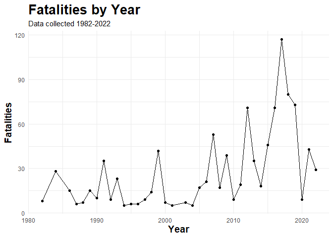
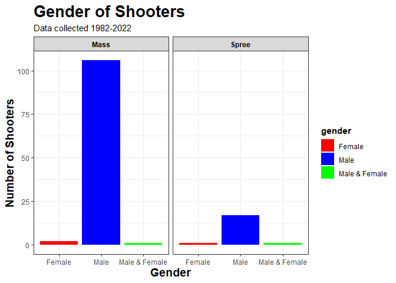
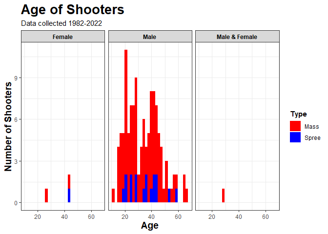
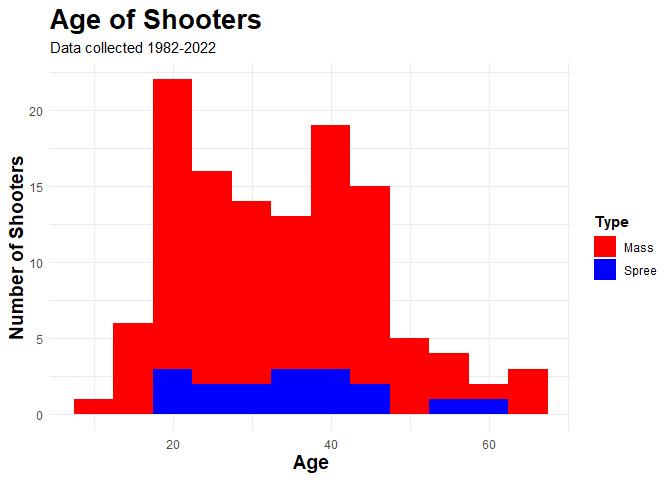
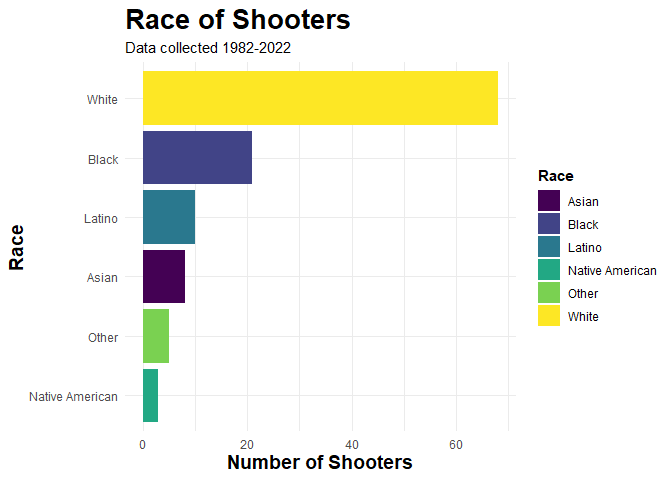
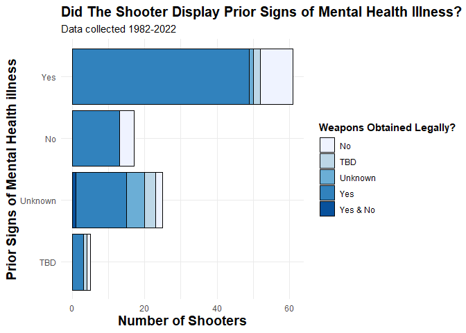

# Investigation Into US Mass Shootings Cases 1982-2022
### Jarred Petersen

*Please note this is not a politically motivated project. This project
was used to continue to develop my data analysis and visualization
techniques*

The issue of guns and gun control is a topic that is constantly up for
debate in the US. During this R markdown project, I wanted to remove
politics from the equation, and use data analysis and visualization
techniques to investigate and analyze several variables and their link
to US mass shooting incidents to better understand this issue. The data
set I will use for this project contains information relating to US mass
shooting incidents from 1982-2022. It is important to note that this
data set does not contain information on all mass shooting incidents
that have occurred during this time frame.

*Link to data*

<https://www.kaggle.com/datasets/zusmani/us-mass-shootings-last-50-years?datasetId=2778&language=R>

    library(readr)          #Load readr package
    library(ggplot2)        #load ggplot package
    library(tidyverse)      #load tidyverse package

    ## ── Attaching core tidyverse packages ──────────────────────── tidyverse 2.0.0 ──
    ## ✔ dplyr     1.1.4     ✔ stringr   1.5.1
    ## ✔ forcats   1.0.0     ✔ tibble    3.2.1
    ## ✔ lubridate 1.9.3     ✔ tidyr     1.3.0
    ## ✔ purrr     1.0.2     
    ## ── Conflicts ────────────────────────────────────────── tidyverse_conflicts() ──
    ## ✖ dplyr::filter() masks stats::filter()
    ## ✖ dplyr::lag()    masks stats::lag()
    ## ℹ Use the conflicted package (<http://conflicted.r-lib.org/>) to force all conflicts to become errors

    library(dplyr)          #load dplyr package
    library(plotly)         #load plotly package

    ## 
    ## Attaching package: 'plotly'
    ## 
    ## The following object is masked from 'package:ggplot2':
    ## 
    ##     last_plot
    ## 
    ## The following object is masked from 'package:stats':
    ## 
    ##     filter
    ## 
    ## The following object is masked from 'package:graphics':
    ## 
    ##     layout

### Read in, Clean & Prepare Date

Before I build any visualizations from this data set, I will have to
read in, and clean and prepare the data.

    shootings<- read_csv("US Mass Shootings May 24 2022.csv")  #read in data as shootings data frame

    ## New names:
    ## Rows: 128 Columns: 24
    ## ── Column specification
    ## ──────────────────────────────────────────────────────── Delimiter: "," chr
    ## (20): case, location...2, date, summary, injured, total_victims, locatio... dbl
    ## (4): fatalities, latitude, longitude, year
    ## ℹ Use `spec()` to retrieve the full column specification for this data. ℹ
    ## Specify the column types or set `show_col_types = FALSE` to quiet this message.
    ## • `location` -> `location...2`
    ## • `location` -> `location...8`

    str(shootings)                                             #view structure of data frame

    ## spc_tbl_ [128 × 24] (S3: spec_tbl_df/tbl_df/tbl/data.frame)
    ##  $ case                            : chr [1:128] "Uvalde elementary school massacre" "Buffalo supermarket massacre" "Sacramento County church shooting" "Oxford High School shooting" ...
    ##  $ location...2                    : chr [1:128] "Uvalde, Texas" "Buffalo, New York" "Sacramento, California" "Oxford, Michigan" ...
    ##  $ date                            : chr [1:128] "5/24/22" "5/14/22" "2/28/22" "11/30/21" ...
    ##  $ summary                         : chr [1:128] "DETAILS PENDING" "Payton S. Gendron, 18, committed a racially motivated mass murder before surrendering to police, according to p"| __truncated__ "\"A man believed to be meeting his three children for a supervised visit at a church just outside Sacramento on"| __truncated__ "Ethan Crumbley, a 15-year-old student at Oxford High School, opened fire with a Sig Sauer 9mm pistol purchased "| __truncated__ ...
    ##  $ fatalities                      : num [1:128] 15 10 4 4 9 8 4 10 8 4 ...
    ##  $ injured                         : chr [1:128] "-" "3" "0" "7" ...
    ##  $ total_victims                   : chr [1:128] "-" "13" "4" "11" ...
    ##  $ location...8                    : chr [1:128] "School" "workplace" "Religious" "School" ...
    ##  $ age_of_shooter                  : chr [1:128] "18" "18" "-" "15" ...
    ##  $ prior_signs_mental_health_issues: chr [1:128] "-" "yes" "-" "-" ...
    ##  $ mental_health_details           : chr [1:128] "-" "previous threats and a mental health evaluation prompted by state police investigation in June 2021" "-" "-" ...
    ##  $ weapons_obtained_legally        : chr [1:128] "-" "yes" "-" "-" ...
    ##  $ where_obtained                  : chr [1:128] "-" "-" "-" "-" ...
    ##  $ weapon_type                     : chr [1:128] "-" "semiautomatic rifle" "-" "semiautomatic handgun" ...
    ##  $ weapon_details                  : chr [1:128] "-" "Bushmaster XM-15 semiautomatic rifle" "-" "Sig Sauer 9mm pistol" ...
    ##  $ race                            : chr [1:128] "-" "White" "-" "-" ...
    ##  $ gender                          : chr [1:128] "M" "M" "M" "M" ...
    ##  $ sources                         : chr [1:128] "https://abcnews.go.com/US/texas-elementary-school-reports-active-shooter-campus/story?id=84940951&cid=social_twitter_abcn" "https://www.nytimes.com/live/2022/05/15/nyregion/shooting-buffalo-ny; https://www.washingtonpost.com/investigat"| __truncated__ "https://www.nytimes.com/2022/02/28/us/church-shooting-sacramento.html; https://www.latimes.com/california/story"| __truncated__ "https://www.washingtonpost.com/nation/2021/11/30/oxford-high-school-shooting/; https://www.cnn.com/videos/us/20"| __truncated__ ...
    ##  $ mental_health_sources           : chr [1:128] "-" "https://www.nytimes.com/2022/05/15/nyregion/gunman-buffalo-shooting-suspect.html" "-" "-" ...
    ##  $ sources_additional_age          : chr [1:128] "-" "-" "-" "-" ...
    ##  $ latitude                        : num [1:128] 29.2 42.9 38.6 42.8 37.3 ...
    ##  $ longitude                       : num [1:128] -99.8 -78.9 -121.4 -83.3 -121.9 ...
    ##  $ type                            : chr [1:128] "Mass" "Mass" "Mass" "Mass" ...
    ##  $ year                            : num [1:128] 2022 2022 2022 2021 2021 ...
    ##  - attr(*, "spec")=
    ##   .. cols(
    ##   ..   case = col_character(),
    ##   ..   location...2 = col_character(),
    ##   ..   date = col_character(),
    ##   ..   summary = col_character(),
    ##   ..   fatalities = col_double(),
    ##   ..   injured = col_character(),
    ##   ..   total_victims = col_character(),
    ##   ..   location...8 = col_character(),
    ##   ..   age_of_shooter = col_character(),
    ##   ..   prior_signs_mental_health_issues = col_character(),
    ##   ..   mental_health_details = col_character(),
    ##   ..   weapons_obtained_legally = col_character(),
    ##   ..   where_obtained = col_character(),
    ##   ..   weapon_type = col_character(),
    ##   ..   weapon_details = col_character(),
    ##   ..   race = col_character(),
    ##   ..   gender = col_character(),
    ##   ..   sources = col_character(),
    ##   ..   mental_health_sources = col_character(),
    ##   ..   sources_additional_age = col_character(),
    ##   ..   latitude = col_double(),
    ##   ..   longitude = col_double(),
    ##   ..   type = col_character(),
    ##   ..   year = col_double()
    ##   .. )
    ##  - attr(*, "problems")=<externalptr>

When I view the structure of the data set, I see there are 24 variables,
and 128 observations. There are lots of things that I need to do to
clean this data set so that it is ready to visualize. Firstly, I need to
select the specific variables I want to look at, these are; case,
location…2, location…8, year, gender, race, fatalities, injured, total
victims, age of shooter, prior signs of mental illness, weapons obtained
legally, type, latitude, longitude.

    shootings1 <- shootings %>%                     #Create shootings 1 data frame
      select("case",                                #select following variables - case
             "location...2",                        #location...2
             "location...8",                        #location...3
             "year",                                #year
             "gender",                              #gender
             "race",                                #race
             "fatalities",                          #fatalities
             "injured",                             #injured 
             "total_victims",                       #total_victims
             "age_of_shooter",                      #age of shooter
             "prior_signs_mental_health_issues",    #prior signs mental health 
             "weapons_obtained_legally",            #weapons obtained legally 
             "type",                                #type
             "latitude",                            #latitude
             "longitude")                           #longitude

Now that I have the variables I want to look at, I will rename the
location variables, and prior signs of mental health variable. I will
also change the “-” values to NA and “unclear” values to NA.

    shootings2 <- rename(shootings1, State = location...2,    #rename: location...2 to state
                         Location = location...8,             #location...8 to Location
                         Mental.illness = prior_signs_mental_health_issues, #Mental.illness = Prior_signs_mental_health_issues
                         Age = age_of_shooter) %>%            #age_of_shooter to Age
      mutate(race = na_if(race, "-"),                         #replace'-' values with NA in race variable
                          Age = na_if(Age, "-"),              # '-' to NA in Age variable
             Mental.illness = na_if(Mental.illness, "-"),     #'-' to NA in Mental.illness variable
             weapons_obtained_legally = na_if(weapons_obtained_legally, "-"), #'-' to NA in weapons obtained legally
             race = na_if(race, "unclear"))                   #Change unclear in race to NA

Next, in the state variable I just want the state name, so I will remove
the city characters.

    shootings2$State <- gsub('(.*, )','', shootings2$State) #Remove the city characters in state variable

Now that I have the state names, I will add the state codes from a
separate data set. I want state codes present in the data tibble for
when I create a map later on in the project. The ‘plotly’ package needed
for map creation works with state codes.

    state_names <- read_csv("state_names.csv")           #read in data set with state codes 

    ## Rows: 51 Columns: 4
    ## ── Column specification ────────────────────────────────────────────────────────
    ## Delimiter: ","
    ## chr (3): State, Abbreviation, Alpha code
    ## dbl (1): Code
    ## 
    ## ℹ Use `spec()` to retrieve the full column specification for this data.
    ## ℹ Specify the column types or set `show_col_types = FALSE` to quiet this message.

    shootings3 <- merge(x = shootings2, y = state_names, #merge shootings2 data frame with state_names
                        by = "State") %>%                #by "State" variable
      
      select("case",                                     #select the following variables - case
             "Alpha code",                               #alpha code 
             "Location",                                 #location
             "year",                                     #year
             "gender",                                   #gender
             "race",                                     #race
             "fatalities",                               #fatalities
             "injured",                                  #injured
             "total_victims",                            #total_victims
             "Age",                                      #age
             "Mental.illness",                           #mental.illness
             "weapons_obtained_legally",                 #weapons_obtained_legally
             "type",                                     #type
             "latitude",                                 #latitude
             "longitude")                                #longitude

Before changing the variables to factors, there are some values in
variables that will be recognised as different factors, but are the same
factor, for example, in race variable, there are “White” and “white”
values that need mutating.

    shootings4 <-  shootings3 %>%                    #create shootings 4 data frame from shootings 3
      mutate(gender = recode(gender, "M" = "Male",   #change 'M' values in gender to 'Male'
                             "F" = "Female")) %>%    #Change 'F' Values in gender to 'Female'
      mutate(race = recode(race, "white" = "White",  #change 'white' values in race to 'White'
                             "black" = "Black")) %>% #Change 'black' values in race to 'Black'
      mutate(Mental.illness= recode(Mental.illness, "yes" = "Yes", #recode 'yes' to "Yes"  mental illness 
                                    "Unclear" = "Unknown")) %>%   #'unclear' to "Unknown" mental illness
      mutate(weapons_obtained_legally = recode(weapons_obtained_legally, #change weapons obtained legally
                                               "yes" = "Yes",       #change 'yes' to 'Yes'
                                               "\nYes" = "Yes"))    #"\nYes" values to 'Yes'

Now I will change the alpha code variable to state, and change race,
gender, mental illness, type, year, and weapons obtained legally to
factors, latitude and longitude to numeric, and fatalities, age,
injured, total\_victims to integers.

    USshootings <- rename(shootings4, State = 'Alpha code') %>%  #rename alpha code to state
      mutate_at(c("Mental.illness", "weapons_obtained_legally",  #change listed variables
                  "race", "gender", "type"), as.factor) %>%      #to factors
      mutate_at(c("latitude", "longitude", "year"), as.numeric) %>% #mutate listed variables to numeric data 
      mutate_at(c("fatalities", "Age", "injured", "total_victims"), as.integer) #mutate listed to integers

    ## Warning: There were 2 warnings in `mutate()`.
    ## The first warning was:
    ## ℹ In argument: `injured = .Primitive("as.integer")(injured)`.
    ## Caused by warning:
    ## ! NAs introduced by coercion
    ## ℹ Run `dplyr::last_dplyr_warnings()` to see the 1 remaining warning.

### Explore Data

Now that the data set has been cleaned, I can explore the data set.

    str(USshootings)       #view structure of USshootings data frame

    ## 'data.frame':    128 obs. of  15 variables:
    ##  $ case                    : chr  "Tucson shooting" "Westside Middle School killings" "San Bernardino mass shooting" "San Jose VTA shooting" ...
    ##  $ State                   : chr  "AZ" "AR" "CA" "CA" ...
    ##  $ Location                : chr  "Other" "School" "\nWorkplace" "Workplace" ...
    ##  $ year                    : num  2011 1998 2015 2021 1997 ...
    ##  $ gender                  : Factor w/ 3 levels "Female","Male",..: 2 2 3 2 2 2 2 2 1 2 ...
    ##  $ race                    : Factor w/ 6 levels "Asian","Black",..: 6 6 5 NA 3 NA 1 6 6 NA ...
    ##  $ fatalities              : int  6 5 14 9 5 3 3 22 8 4 ...
    ##  $ injured                 : int  13 10 21 0 2 12 0 19 0 0 ...
    ##  $ total_victims           : int  19 15 35 9 7 15 3 41 8 4 ...
    ##  $ Age                     : int  22 11 28 57 41 19 36 41 44 NA ...
    ##  $ Mental.illness          : Factor w/ 4 levels "No","TBD","Unknown",..: 4 1 3 4 1 2 4 4 4 NA ...
    ##  $ weapons_obtained_legally: Factor w/ 5 levels "No","TBD","Unknown",..: 4 1 4 NA 4 4 4 4 4 NA ...
    ##  $ type                    : Factor w/ 2 levels "Mass","Spree": 1 1 1 1 2 1 1 1 1 1 ...
    ##  $ latitude                : num  32.3 35.8 34.1 37.3 33.8 ...
    ##  $ longitude               : num  -111 -90.7 -117.3 -121.9 -117.9 ...

Viewing the structure of the data set, there are 15 variables and 128
observations.

    summary(USshootings) #show summary statistics of variables in data frame

    ##      case              State             Location              year     
    ##  Length:128         Length:128         Length:128         Min.   :1982  
    ##  Class :character   Class :character   Class :character   1st Qu.:2001  
    ##  Mode  :character   Mode  :character   Mode  :character   Median :2013  
    ##                                                           Mean   :2009  
    ##                                                           3rd Qu.:2018  
    ##                                                           Max.   :2022  
    ##                                                                         
    ##            gender                 race      fatalities        injured      
    ##  Female       :  3   Asian          : 8   Min.   : 3.000   Min.   :  0.00  
    ##  Male         :123   Black          :21   1st Qu.: 4.000   1st Qu.:  1.00  
    ##  Male & Female:  2   Latino         :10   Median : 6.000   Median :  3.00  
    ##                      Native American: 3   Mean   : 8.039   Mean   : 11.51  
    ##                      Other          : 5   3rd Qu.: 9.000   3rd Qu.: 10.00  
    ##                      White          :68   Max.   :58.000   Max.   :546.00  
    ##                      NA's           :13                    NA's   :1       
    ##  total_victims        Age        Mental.illness weapons_obtained_legally
    ##  Min.   :  3.0   Min.   :11.00   No     :17     No      :16             
    ##  1st Qu.:  6.5   1st Qu.:23.75   TBD    : 5     TBD     : 7             
    ##  Median : 10.0   Median :33.50   Unknown:25     Unknown : 6             
    ##  Mean   : 19.5   Mean   :33.74   Yes    :63     Yes     :86             
    ##  3rd Qu.: 17.0   3rd Qu.:42.25   NA's   :18     Yes & No: 1             
    ##  Max.   :604.0   Max.   :66.00                  NA's    :12             
    ##  NA's   :1       NA's   :4                                              
    ##     type        latitude       longitude      
    ##  Mass :109   Min.   :21.32   Min.   :-157.88  
    ##  Spree: 19   1st Qu.:33.78   1st Qu.:-117.37  
    ##              Median :38.32   Median : -90.87  
    ##              Mean   :37.36   Mean   : -96.72  
    ##              3rd Qu.:41.50   3rd Qu.: -81.44  
    ##              Max.   :48.46   Max.   : -71.08  
    ## 

Above are the summary statistics for the 15 variables. For the factor
data types, it gives the number of observations per factor. for the
integer and numeric types, it gives us the min, 1st quartile, median,
mean, 3rd quartile and max values.

    head(USshootings)    #View first 6 rows of data frame

    ##                                 case State    Location year        gender
    ## 1                    Tucson shooting    AZ       Other 2011          Male
    ## 2    Westside Middle School killings    AR      School 1998          Male
    ## 3       San Bernardino mass shooting    CA \nWorkplace 2015 Male & Female
    ## 4              San Jose VTA shooting    CA   Workplace 2021          Male
    ## 5 Caltrans maintenance yard shooting    CA   Workplace 1997          Male
    ## 6    Gilroy garlic festival shooting    CA       Other 2019          Male
    ##     race fatalities injured total_victims Age Mental.illness
    ## 1  White          6      13            19  22            Yes
    ## 2  White          5      10            15  11             No
    ## 3  Other         14      21            35  28        Unknown
    ## 4   <NA>          9       0             9  57            Yes
    ## 5 Latino          5       2             7  41             No
    ## 6   <NA>          3      12            15  19            TBD
    ##   weapons_obtained_legally  type latitude  longitude
    ## 1                      Yes  Mass 32.33594 -110.97513
    ## 2                       No  Mass 35.82099  -90.66826
    ## 3                      Yes  Mass 34.07596 -117.27789
    ## 4                     <NA>  Mass 37.31610 -121.88853
    ## 5                      Yes Spree 33.78779 -117.85311
    ## 6                      Yes  Mass 36.99719 -121.58482

    tail(USshootings)    #view last 6 rows of data frame

    ##                              case State  Location year gender   race fatalities
    ## 123       Air Force base shooting    WA  Military 1994   Male  White          5
    ## 124 Trestle Trail bridge shooting    WI     Other 2015   Male Latino          3
    ## 125 Living Church of God shooting    WI Religious 2005   Male  White          7
    ## 126         Molson Coors shooting    WI Workplace 2020   Male  Black          5
    ## 127              Crandon shooting    WI     Other 2007   Male  White          6
    ## 128          Sikh temple shooting    WI Religious 2012   Male  White          7
    ##     injured total_victims Age Mental.illness weapons_obtained_legally  type
    ## 123      23            28  20            Yes                      Yes  Mass
    ## 124       1             4  27            Yes                      Yes  Mass
    ## 125       4            11  44            Yes                      Yes Spree
    ## 126       0             5  51           <NA>                     <NA>  Mass
    ## 127       1             7  20        Unknown                      Yes  Mass
    ## 128       3            10  40            Yes                      Yes  Mass
    ##     latitude  longitude
    ## 123 47.61864 -117.64836
    ## 124 44.20412  -88.46754
    ## 125 43.06057  -88.10648
    ## 126 43.04451  -87.96254
    ## 127 45.57191  -88.90289
    ## 128 42.88585  -87.86314

Above, we have the first and last 6 rows of the data set.

    USshootings %>%                         #Use USshootings data frame
      group_by(year) %>%                    #group by year and fatalities 
      summarise(sum = sum(fatalities, na.rm = TRUE)) %>%  #sum of fatalities by year
      ggplot(aes(year, sum))+               #plot year on x, sum of fatalities on y 
      geom_point()+                         #plot scatter plot
      geom_line()+                          #add line
          labs(title = "Fatalities by Year ",               #Set labels -main title
           subtitle = "Data collected 1982-2022",           #Set Subtitle 
           x = "Year",                                      #x = year 
           y = "Fatalities")+                               #y = Fatalities
      theme_minimal()+                                      #use black and white theme
      theme(plot.title = element_text(size = 20,            #size of title text at 20, 
                                      face = "bold",        #make it bold,
                                      color = "black"),    #color of text = black. 
            axis.title.x = element_text(size = 14,          #set x axis title text to 14, 
                                        face = "bold",      #make it bold,
                                        color = "black"),  #color of text = black 
            axis.title.y = element_text(size = 14,          #set y axis title text to 14,
                                        face = "bold",      #make it bold,
                                        color = "black"))  #set text color to black

Above we have a line graph that shows the total number of fatalities of
US mass shootings by year. This graph shows that the total number of
fatalities by year from this data set has risen and fallen over the time
period. However, it does appear that there has been a slight increase in
fatalities from 1982-2022, especially from 2005. From 2005 there is a
steep rise in fatalities up to its highest peak in the year 2012/13
before the total number of fatalities decreases again the next year. It
is important to note that this is the total number of fatalities by year
from the cases included in the data set, not the total number of
fatalities by year from all the mass shooting cases during this time
period.

### Visualization 1 - Map of US Mass Shooting incidents

The first visualization I will create is a map showing the location of
all the mass shootings in the US from 1982-2022.

    map_prop <- list(                      #setting up map properties by creating map_prop data frame
      scope = 'usa',                       #scope focusing on USA
      project = list(type = 'albers usa'), #using 'albers usa' projection 
      showland = TRUE,                     #set show land to True
      showlakes = TRUE,                    #set show lakes to True
      lakecolor = "lightblue",             #lake color set to light blue
      showsubunits = TRUE,                 #show subunits - the states
      landcolor = toRGB('beige'))          #land color set to beige

    USshooting_map <-  USshootings %>%            #creating USshooting_map  from USshooting data frame
      plot_geo(lat = ~latitude,                   #lat = latitude variable
               lon = ~longitude,                  #lon = longitude variable
               marker = list(size = ~fatalities,  #set marker parameters- size of markers by fatalities
                             color = 'red'),      #Color of markers set to red
               text = ~year,                      #Add year to hover text
               hoverinfo = 'text') %>%            #hover info show 'text' which = year
      config(displayModeBar = FALSE) %>%                        #do not show tool bar
      layout(geo = map_prop,                                    #layout = map_prop data frame set up earlier 
             title = "US Mass Shootings 1982-2022")             #add title

    #USshooting_map                                              #view map

Above we have the map showing all US mass shootings in the US from
1982-2022. The hover information displays the year of the shooting.
California has had a significant amount of shootings during this time
period. Other states with a high number of mass shootings include Texas
and Florida. The eastern states have had more mass shootings from
1982-2022 when compared to the western states. The mid western states
appear to have had less mass shooting cases when compared with other
states.

### Visualization 2 - Gender of Shooter

Next, I will explore the gender of the shooters during this time period
for mass and spree shootings.

    USshootings %>%                #use USshootings data frame
      ggplot(aes(gender,           #plot gender on x
                 fill = gender))+  #fill color by gender
      geom_bar()+                  #plot bar chart
      facet_grid(~type)+           #facet grid by type
      labs(title = "Gender of Shooters", #Set labs -main title
           subtitle = "Data collected 1982-2022",           #Set Subtitle 
           x = "Gender",                                    #x = Gender
           y = "Number of Shooters",                        #y = Number of shooters
           fill = "Gender")+                                            #legend title = Gender
      scale_fill_manual("gender", values = c("Male" = "blue",           #scale fill color - Male = blue
                                           "Female" = "red",            #Female = red
                                           "Male & Female" = "green"))+ #Male & Female = green
      theme_bw()+                                           #use black and white theme
      theme(plot.title = element_text(size = 20,            #size of title text at 20, 
                                      face = "bold",        #make it bold,
                                      color = "black"),    #color of text = black. 
            axis.title.x = element_text(size = 14,          #set x axis title text to 14, 
                                        face = "bold",      #make it bold,
                                        color = "black"),  #color of text = black 
            axis.title.y = element_text(size = 14,          #set y axis title text to 14,
                                        face = "bold",      #make it bold,
                                        color = "black"),  #set text color to black
            strip.text.x = element_text(face = "bold",      #edit facet grid text - make bold
                                        color = "black"),  #color of text = black
            legend.title = element_text(face = "bold",      #make legend title bold
                                        color = "black"))  #make text color black

The above bar chart shows that there is significantly more male shooters
for mass and spree shooting in the US from 1982-2022. For mass
shootings, over 100 of the shooters were males, and 1 male was involved
in a male & female mass shooting. For spree shootings, there was
significantly more male shooters than female shooters. We can
confidently conclude from this visualization majority of US mass
shooting are carried out by males.

### Visualization 3 - Age of Shooter

Next, I will investigate the age of the shooters that carried out the
mass shooting cases present in this data set 1982-2022.

    USshootings %>%                     #Use USshootings dataframe
      ggplot(aes(Age,                   #plot age on x
                 fill = type))+         #fill color by type
      geom_histogram()+                 #plot histogram
      scale_fill_manual("Type",                        #scale fill colors manually 
                        values = c("Mass" = "red",     #mass values = red
                                   "Spree" = "blue"))+ #spree values = blue
      facet_grid(~gender)+                             #facet_grid by gender
        labs(title = "Age of Shooters",                #Set labs -main title
           subtitle = "Data collected 1982-2022",           #Set Subtitle 
           x = "Age",                                       #x = Age 
           y = "Number of Shooters",                        #y = Number of shooters
           fill = "Type")+                                  #legend title = Type
      theme_bw()+                                           #use black and white theme
      theme(plot.title = element_text(size = 20,            #size of title text at 20, 
                                      face = "bold",        #make it bold,
                                      color = "black"),    #color of text = black. 
            axis.title.x = element_text(size = 14,          #set x axis title text to 14, 
                                        face = "bold",      #make it bold,
                                        color = "black"),  #color of text = black 
            axis.title.y = element_text(size = 14,          #set y axis title text to 14,
                                        face = "bold",      #make it bold,
                                        color = "black"),  #set text color to black
            strip.text.x = element_text(face = "bold",      #edit facet grid text - make bold
                                        color = "black"),  #color of text = black
            legend.title = element_text(face = "bold",      #make legend title bold
                                        color = "black"))  #make text color black

    ## `stat_bin()` using `bins = 30`. Pick better value with `binwidth`.

    ## Warning: Removed 4 rows containing non-finite values (`stat_bin()`).

Above we see the age distribution of the shooters by gender and color by
shooting type. It is hard to conclude anything from female gender
because there are so few female shooters. Therefore, I will look
specifically at male shooters.

    USshootings %>%                     #Use USshootings data frame
      filter(gender == "Male") %>%      #filter where gender = "Male"
      ggplot(aes(Age,                   #Plot Age on x axis
                 fill = type))+         #fill color by type
      scale_fill_manual("Type",                        #scale fill colors manually 
                        values = c("Mass" = "red",     #mass values = red
                                   "Spree" = "blue"))+ #spree values = blue
      geom_histogram(binwidth = 5)+     #plot histogram with binwidth of 5
        labs(title = "Age of Shooters", #Set labs -main title
           subtitle = "Data collected 1982-2022",           #Set Subtitle 
           x = "Age",                                       #x = Age
           y = "Number of Shooters",                        #y = Number of shooters
           fill = "Type")+                                  #legend title = Type
      theme_minimal()+                                       #use minimal theme
      theme(plot.title = element_text(size = 20,            #size of title text at 20, 
                                      face = "bold",        #make it bold,
                                      color = "black"),    #color of text = black. 
            axis.title.x = element_text(size = 14,          #set x axis title text to 14, 
                                        face = "bold",      #make it bold,
                                        color = "black"),  #color of text = black 
            axis.title.y = element_text(size = 14,          #set y axis title text to 14,
                                        face = "bold",      #make it bold,
                                        color = "black"),  #set text color to black
            strip.text.x = element_text(face = "bold",      #edit facet grid text - make bold
                                        color = "black"),  #color of text = black
            legend.title = element_text(face = "bold",      #make legend title bold
                                        color = "black"))  #make text color black

    ## Warning: Removed 3 rows containing non-finite values (`stat_bin()`).

Looking at the age distribution of male shooters, it appears that the
most frequent age of the male shooter is 20 - 45, with the highest
frequency at age 20. This is true for both mass and spree shootings. We
can conclude that most male shooters fall in the 20-40 range.

### Visualization 4 - Race of Shooter

The next visualization will plot the race of the shooter that carried
out the mass shooting in the cases documented in the data set from
1982-2022.

    USshootings %>%                         #Use USshootings data frame
      drop_na(race) %>%                     #drop na values in race variable
      group_by(race) %>%                    #group by race
      summarise(Count = n()) %>%            #summarize count of each race value
      ggplot(aes(x = reorder(race, +Count), #plot race on x axis - reorder race by count in order
                 y = Count,                 #plot Count on Y
             fill = race))+                 #fill bar color by race
      geom_bar(stat = "identity")+          #plot a bar chart
      scale_fill_viridis_d()+               #Scale fill using viridis discrete color
      coord_flip()+                         #flip chart so its horizontal
      labs(title = "Race of Shooters",      #Set labs -main title
           subtitle = "Data collected 1982-2022",           #Set Subtitle 
           x = "Race",                                      #x = Race
           y = "Number of Shooters",                        #y = Number of shooters
           fill = "Race")+                                  #legend title = race
      theme_minimal()+                                      #use minimal theme
      theme(plot.title = element_text(size = 20,            #size of title text at 20, 
                                      face = "bold",        #make it bold,
                                      color = "black"),    #color of text = black. 
            axis.title.x = element_text(size = 14,          #set x axis title text to 14, 
                                        face = "bold",      #make it bold,
                                        color = "black"),  #color of text = black 
            axis.title.y = element_text(size = 14,          #set y axis title text to 14,
                                        face = "bold",      #make it bold,
                                        color = "black"),  #set text color to black
            strip.text.x = element_text(face = "bold",      #edit facet grid text - make bold
                                        color = "black"),  #color of text = black
            legend.title = element_text(face = "bold",      #make legend title bold
                                        color = "black"))  #make text color black

### Visualization 5 - Did The Shooter Have Prior Signs of Mental Health & Did They Obtain The Weapons Legally?

Finally, I will explore whether the shooters displayed prior signs of
mental health issues, and weather the weapons used were obtained
legally.

    USshootings %>%                                              #Use USshootings data frame
      drop_na(c(weapons_obtained_legally, Mental.illness)) %>%   #drop na values from 2 variables
      group_by(Mental.illness, weapons_obtained_legally) %>%     #group by mental.illness
      summarise(Count = n()) %>%                                #summarize count of each mental.illness value
      ggplot(aes(x = reorder(Mental.illness, +Count),#plot mental.illness on x-reorder race by count in order
                 y = Count,                                      #plot Count on Y
                 fill = weapons_obtained_legally))+              #Fill color by weapons obtained legally
      geom_bar(stat = "identity",                                #plot bar chart using identity stat
               color = "black")+                                 #border color = black
      scale_fill_brewer()+                                       #scale fill by brewer palette
      coord_flip()+                                              #flip chart so its horizontal
        labs(title = "Did The Shooter Display Prior Signs of Mental Health Illness?", #Set labs -main title
           subtitle = "Data collected 1982-2022",           #Set Subtitle 
           x = "Prior Signs of Mental Health illness",      #x = Prior Signs of Mental Health illness 
           y = "Number of Shooters",                        #y = Number of shooters
           fill = "Weapons Obtained Legally?")+             #legend title = weapons obtained legally?
      theme_minimal()+                                      #Use minimal theme
      theme(plot.title = element_text(size = 15,            #size of title text at 15, 
                                      face = "bold",        #make it bold,
                                      color = "black"),    #color of text = black. 
            axis.title.x = element_text(size = 14,          #set x axis title text to 14, 
                                        face = "bold",      #make it bold,
                                        color = "black"),  #color of text = black 
            axis.title.y = element_text(size = 14,          #set y axis title text to 14,
                                        face = "bold",      #make it bold,
                                        color = "black"),  #set text color to black
            strip.text.x = element_text(face = "bold",      #edit facet grid text - make bold
                                        color = "black"),  #color of text = black
            legend.title = element_text(face = "bold",      #make legend title bold
                                        color = "black"))  #make text color black

    ## `summarise()` has grouped output by 'Mental.illness'. You can override using
    ## the `.groups` argument.

We can see that the most shooters did display prior signs of mental
health, with 63 of the 128 shooters having mental health issues. 18 of
the shooters did not display prior signs of mental health. There is a
large proportion of shootings where it is unknown if the shooter
displayed prior signs of mental illness and a very small proportion of
shootings cases where the mental health of the shooter is waiting to be
released. What this graph clearly shows is that the vast majority of the
guns used in the US mass shootings were obtained legally. 86 of the 128
shootings involved the use of guns that were obtained legally. 16
shootings involved weapons that were not obtained legally. It appears
that approximately 48 of the 63 shooters who displayed prior signs of
mental illness obtained the weapons used legally. Less than 10 of the
shooters who displayed prior signs of mental illness used weapons
obtained illegally.

We can conclude from chart that majority of shooters displayed prior
signs of mental illness. However, despite mental illness issues, the
majority still were able to obtain the weapons used legally. The
majority of shooters who did not display mental health issues, or the
mental health of the shooter is unknown or yet to be releases also used
weapons obtained legally.

### Conclusion

From these visualizations, we can conclude the following findings;

*Gender* US mass shootings tend to be carried out by male shooters. The
data showed that mass shooters 1982-2022 were significantly male.

*Age* US mass shootings tend to be carried out by shooters aged 20-40.
The data showed that mass shooters 1982-2022 typically fell into the
20-40 age range, with a highest peak at age 20.

*Race* The majority of mass shootings tend to be carried out by white
shooters. The data showed that the majority of mass shooters 1982-2022
were white.

*Mental Health*

US mass shootings tend to be carried out by shooters with some kind of
mental illness. The data showed that the majority of shooters 1982-2022
displayed prior signs of mental health illnesses.

*Legality of Weapons*

Weapons used in US mass shootings are usually obtained legally. The data
showed that the vast majority of guns used in US mass shootings
1982-2022 were obtained by the shooter legally.

Overall, we can conclude that US mass shootings incidents that took
place 1982-2022 tend to be carried out by white males aged 20-40 with
prior signs of mental illness with weapons they obtain legally.
